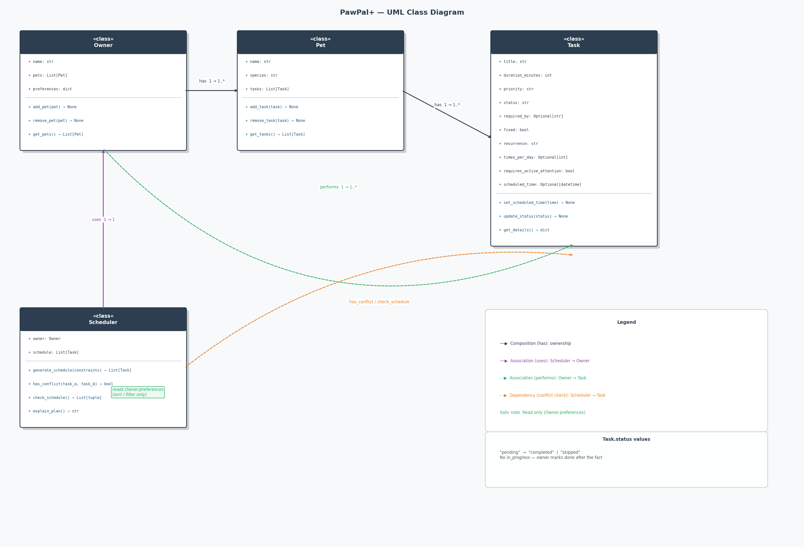
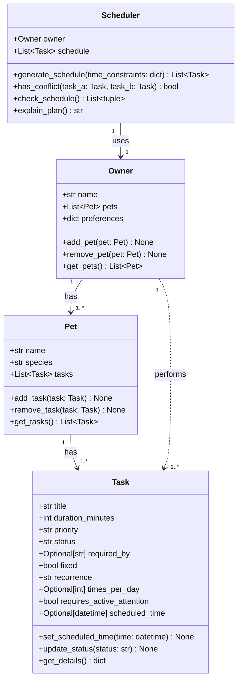

# PawPal+ Class Design

## UML Class Diagrams

## Class Tables

### Task

| Section | Name | Type | Notes |
|---|---|---|---|
| **Attribute** | `title` | `str` | |
| **Attribute** | `duration_minutes` | `int` | |
| **Attribute** | `priority` | `str` | `"low"` / `"medium"` / `"high"` |
| **Attribute** | `status` | `str` | `"pending"` / `"completed"` / `"skipped"` |
| **Attribute** | `required_by` | `Optional[str]` | pet/vet-driven necessity, e.g. `"08:00"` |
| **Attribute** | `fixed` | `bool` | `True` = external schedule (vet), `False` = flexible |
| **Attribute** | `recurrence` | `str` | `"daily"` / `"weekly"` / `"occasional"` / `"one-off"` |
| **Attribute** | `times_per_day` | `Optional[int]` | e.g. `2` for feeding; `None` for vet |
| **Attribute** | `requires_active_attention` | `bool` | `True` = walk/vet (hands-on); `False` = feeding (passive) |
| **Attribute** | `scheduled_time` | `Optional[datetime]` | set by Scheduler |
| **Method** | `set_scheduled_time()` | `(time: datetime) -> None` | |
| **Method** | `update_status()` | `(status: str) -> None` | called by Owner after task is done/skipped |
| **Method** | `get_details()` | `() -> dict` | |

### Pet

| Section | Name | Type | Notes |
|---|---|---|---|
| **Attribute** | `name` | `str` | |
| **Attribute** | `species` | `str` | |
| **Attribute** | `tasks` | `List[Task]` | all tasks associated with this pet |
| **Method** | `add_task()` | `(task: Task) -> None` | |
| **Method** | `remove_task()` | `(task: Task) -> None` | e.g. vet appt cancelled |
| **Method** | `get_tasks()` | `() -> List[Task]` | |

### Owner

| Section | Name | Type | Notes |
|---|---|---|---|
| **Attribute** | `name` | `str` | |
| **Attribute** | `pets` | `List[Pet]` | |
| **Attribute** | `preferences` | `dict` | sort/filter only — e.g. `sort_by`, `filter_species`, `view_mode` |
| **Method** | `add_pet()` | `(pet: Pet) -> None` | |
| **Method** | `remove_pet()` | `(pet: Pet) -> None` | e.g. pet leaves household |
| **Method** | `get_pets()` | `() -> List[Pet]` | |

### Scheduler

| Section | Name | Type | Notes |
|---|---|---|---|
| **Attribute** | `owner` | `Owner` | |
| **Attribute** | `schedule` | `List[Task]` | final scheduled task instances |
| **Method** | `generate_schedule()` | `(time_constraints: dict) -> List[Task]` | builds schedule while avoiding conflicts |
| **Method** | `has_conflict()` | `(task_a: Task, task_b: Task) -> bool` | checks time overlap + active attention rules |
| **Method** | `check_schedule()` | `() -> List[tuple]` | scans full schedule, returns all conflict pairs |
| **Method** | `explain_plan()` | `() -> str` | AI-generated explanation of why/when tasks are scheduled |

## Relationships

| From | Relationship | To | Multiplicity | Notes |
|---|---|---|---|---|
| `Owner` | **has** (Composition) | `Pet` | 1 → 1..* | Owner manages one or more pets |
| `Pet` | **has** (Composition) | `Task` | 1 → 1..* | Tasks belong to a pet — subject of the task |
| `Owner` | **performs** (Association) | `Task` | 1 → 1..* | Owner executes tasks; calls `update_status()` |
| `Scheduler` | **uses** (Association) | `Owner` | 1 → 1 | Entry point to access pets and tasks |
| `Scheduler` | **calls** | `has_conflict()` | — | called inside `generate_schedule()` to avoid conflicts |
| `Scheduler` | **reads** | `Owner.preferences` | — | Sort/filter output only, not scheduling logic |

## Design Notes

### Task constraints are necessity-driven, not preference-driven
- `required_by` — when a task *must* happen, set by pet need or external schedule (e.g. vet)
- `fixed=True` — cannot be moved (e.g. vet appointment); `fixed=False` — flexible
- `recurrence` — `"daily"` / `"weekly"` / `"occasional"` / `"one-off"`
- `times_per_day` — for repeating tasks like feeding (2–3x) or walks (1–3x)

### Task status
- `"pending"` — not yet done (default)
- `"completed"` — owner marked done after the fact
- `"skipped"` — consciously not done (e.g. vet cancelled, dog not hungry)
- No `"in_progress"` — owner does not check the app mid-task

### Owner and Task: two distinct relationships
- `Pet` **owns** Task (composition) — the task is *about* the pet
- `Owner` **performs** Task (association) — the owner *does* the task
- Owner calls `task.update_status()` after completing or skipping a task
- Owner does not aggregate tasks directly — Scheduler surfaces them via `schedule`

### Owner preferences are display/organization only
- Used by Scheduler to sort and filter output — e.g. `sort_by`, `filter_species`, `view_mode`
- Do NOT control when tasks happen — that is driven by the task itself

### Conflict detection rules
- **Same-pet conflict** — always a conflict: one pet cannot have two tasks at the same time
- **Cross-pet conflict** — conflict only if at least one task has `requires_active_attention=True`
- Feeding two pets at the same time → OK (`requires_active_attention=False` for both)
- Walking dog while feeding cat → conflict (`requires_active_attention=True` for walk)
- Taking cat and dog to vet at same time → conflict (both require active attention)
- `generate_schedule()` calls `has_conflict()` proactively to avoid conflicts while building
- `check_schedule()` is a safety net — validates the full schedule after it is built
